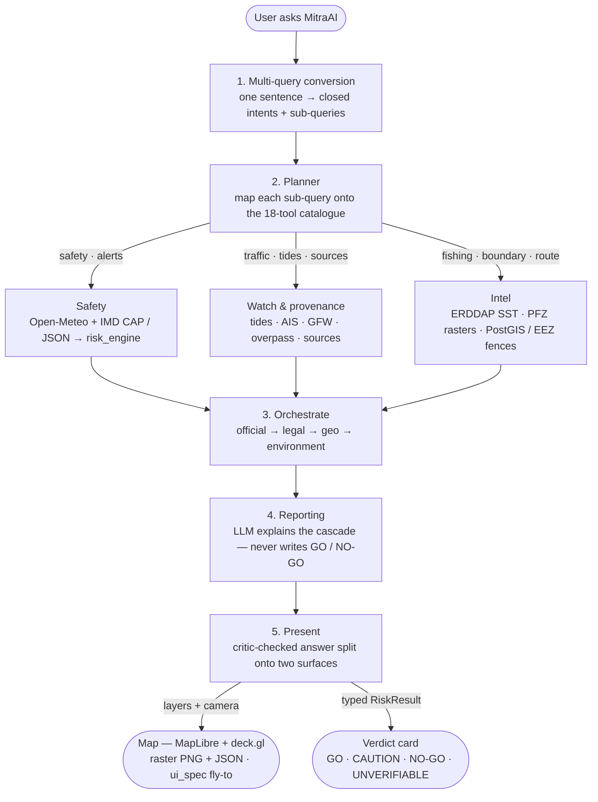

# ORCA — Architectural flow (slide deck text)

Copy each **Slide** block into PowerPoint. Speaker notes are in *italics* under each slide.

Companion deck: `docs/ORCA_DECISION_LOGIC_SLIDES.md` (how the verdict is calculated).  
This deck: **how a question travels through the system.**

---

## Slide 1 — Title

**ORCA architectural flow**

From a fisherman’s question to a cited answer

- A map pin + a question — not a chatbot in the abstract
- The planner picks tools; the rule engine writes the verdict
- The language model **explains** — it never decides GO / NO-GO

*Walk this deck as a story: where the question enters, how tools are chosen, what runs in parallel, where the verdict is written, and what is stored.*

---

## Slide 2 — What kind of system this is

**Not a single LLM with plugins.**  
A **supervisor graph** with a visible plan, a deterministic core, and a critic that can bounce a draft.

| Plane | Job |
|---|---|
| Console | Map, chat (MitraAI), verdict card, evidence |
| API | Two doors: click vs conversation |
| Agent graph | Split question → pick tools → run → compose |
| Rule engine | GO / CAUTION / NO-GO / UNVERIFIABLE |
| Source adapters | IMD, Open-Meteo, satellites, vessels |
| Stores | SQLite (default), optional PostGIS / Redis, raster files |

*If a professor asks “is this just ChatGPT?” — this slide is the answer. The model never owns the safety bit.*

---

## Slide 3 — Two front doors, one verdict

```
MAP CLICK                         CHAT (MitraAI)
     │                                  │
forecast + /risk/assess           POST /agent/stream
     │                                  │
     └────────── same RiskResult ───────┘
                      │
              Verdict card on the map
```

| Door | What happens | Waits on an LLM? |
|---|---|---|
| Click the sea | Live sea state + rule engine | No |
| Ask MitraAI | Planner chooses tools, then the **same** rule engine | Yes — only to plan and explain |

*Demo: click first (instant card), then ask “is it safe tomorrow?” The card and the chat must agree. `verdict_source` is locked to `rule_engine`.*

---

## Slide 4 — The stack (top to bottom)

```
L0  Console          MapLibre + chat + voice
L1  API doors        FastAPI  ·  SSE for the agent
L2  Agent graph      LangGraph  ·  7 nodes
L3  Deterministic    Risk, geofence, PFZ, routing
L4  Adapters         One client per upstream
L5  Stores           DB / cache / rasters on disk
```

Each plane may call the one **below**.  
Nothing below the critic is allowed to invent a safety verdict.

*L3 has no language-model imports. That is a code-level firewall, not a prompt instruction.*

---

## Slide 5 — End-to-end flow (the one diagram)

Paste `docs/ORCA_AGENT_FLOW.mmd` into [mermaid.live](https://mermaid.live) and export a PNG for this slide.



*After the planner: three named lanes (not numbered), then the join. Safety = sea state + IMD + risk. Intel = PFZ / SST / fences. Watch & provenance = the other catalogue tools (tides, AIS, GFW, overpass, source list). Box 5 forks to map and verdict card.*

---

## Slide 6 — How a question becomes a tool list

A compound question is **three questions**, not one paragraph.

Example: *“Is it safe tomorrow, and where are the fish near here?”*

| Layer | Who | Result |
|---|---|---|
| **Decompose** | Model + a no-model fallback | Intents: `future_safety` + `fishing` |
| **Plan** | Model + tool catalogue | Visible step list streamed to the UI |
| **Merge** | Deterministic code | Force required tools, drop extras, **order** them |

**Closed intents** (not free text): safety, tomorrow-safety, alerts, fishing, boundary, routing, traffic, …

Conditions are **always** fetched before risk is scored. That order is code, not a prompt.

*The fallback splitter (and / ?) means the feature still works if every LLM is down. The professor can ask “what if Groq is dead?” — the click path still scores; the chat path degrades to a safety-first tool pair.*

---

## Slide 7 — Three lanes after the plan

| Lane | Typical tools | Upstream | Output |
|---|---|---|---|
| **Safety** | sea state, IMD alerts, assess risk | Open-Meteo; IMD CAP RSS (+ JSON if keyed) | `RiskResult` |
| **Intel** | PFZ, SST, geofence, optional AIS / GFW | ERDDAP, raster files, Marine Regions | zones, distance, traffic |
| **Map** | camera + layer hints | last ingest on disk | `ui_spec` (bbox, layers, marker) |

Lanes do **not** wait on each other. They join at **orchestrate** with **evidence**, not with another model call.

*Honest line if asked: the live demo still runs tools one-by-one so the on-screen trace is readable. The architecture is the three-lane join. Map ingest is a separate manual refresh — a query does not re-download India.*

---

## Slide 8 — After the tools: orchestrate → write → critic

```
Evidence from all lanes
        │
ORCHESTRATE     first hard stop wins
                official warning > legal > IMBL/EEZ > sea state
        │
REPORTING       language model writes the explanation
                it is forbidden to change the verdict
        │
CRITIC          mechanical checks (no model)
                “conditions are marginal” over a NO-GO → REJECT
        │
        approve ──────────────► ship answer
        bounce (≤2) ──────────► reporting again
        still wrong ──────────► deterministic fallback text
```

*This is the same cascade as the decision-logic deck. Here the point is placement: cascade sits after tools and before prose.*

---

## Slide 9 — Where the numbers come from

| Need | Source | Key / auth | Live on this request? |
|---|---|---|---|
| Waves, wind, visibility, CAPE | Open-Meteo Marine + Forecast | none | Yes (short memory cache) |
| Official fishermen / cyclone | IMD CAP RSS; JSON gateway | `IMD_API_KEY` + IP whitelist for JSON | RSS always; JSON after registration |
| SST / chlorophyll / PFZ map | NOAA MUR, ESA CCI via ERDDAP | none | Map layers from last ingest; point SST can be live |
| EEZ / IMBL | Marine Regions → `fences.geojson` | none | Curated file on disk |
| Tides | WorldTides | `WORLDTIDES_API_KEY` | If configured |
| Nearby vessels | AISStream | `AISSTREAM_API_KEY` | If configured |
| Fishing effort | Global Fishing Watch | `GFW_API_TOKEN` | If configured |

**Models (plan + explain only):** Groq → Groq backup → Gemini → OpenRouter → local Ollama.  
**Voice:** Sarvam (`SARVAM_API_KEY`).  
A missing key **dorms that adapter**. It does not invent data.

*Unknown official status is flagged, not treated as “all clear.” Same honesty rule as the decision deck.*

---

## Slide 10 — What is stored (and what is not)

| Store | Role | Survives restart? |
|---|---|---|
| **SQLite** (`backend/data/orca.db`) | Default local database | File yes |
| **PostGIS** (optional `DATABASE_URL`) | Hosted Postgres + spatial, if Docker/Supabase is up | If connected |
| **Redis** (optional `:6380`) | Cache / job queue; else in-process memory | If connected |
| **Rasters** (`data/rasters/…png + .json`) | SST, chlorophyll, PFZ, wind/current pictures | Yes |
| **NetCDF cache** | Satellite AOI downloads | Yes |
| **Chat / alert ring** | Last ~60 agent runs in RAM | **No** |

ORCA is **not** a national archive. It is an **operational console**: live point queries, cited evidence, map layers you refresh when you need a new scene.

*If asked “where is the training data?” — there is none. Models are API hops. Science is fetched or derived, then labelled LIVE / CACHED / CURATED / DERIVED.*

---

## Slide 11 — What the professor sees in a live demo

1. Click a coastal point → verdict card appears **without** waiting on chat.  
2. Open MitraAI → plan appears **before** tools run.  
3. Tools land one by one (sea state, IMD, PFZ, …) with real timings.  
4. Decision event: six dimensions, first stop wins.  
5. Map flies to the asked place.  
6. Answer cites sources and age. Softening a NO-GO is rejected if you force a bad draft.

*The trace is the architecture made visible. That is the difference from a chatbot screenshot.*

---

## Slide 12 — Examiner Q&A (short answers)

**Q: Why not one model that “just answers”?**  
A: A model can soften a NO-GO. The verdict is a typed object from the rule engine. The critic re-reads the draft against that object.

**Q: How do you choose which APIs to call?**  
A: Closed intents → required tools, then the planner picks from a catalogue of 18. Merge forces anything the intents demanded. Two different questions pull two different tool sets.

**Q: What if IMD has not issued a key yet?**  
A: Public CAP RSS still runs. Fishermen / cyclone JSON wait on registration. We do not pretend the JSON layer is live.

**Q: Do you store every fisherman’s query?**  
A: No. Traces sit in memory for the session. Rasters and fence files are the durable scientific products.

**Q: Can fishing-zone rank override a warning?**  
A: No. Opportunity is a separate dimension. Official warning wins the cascade. (See the decision-logic deck.)

**Q: Is the map updated automatically every hour?**  
A: No. Point safety is live. Map layers refresh when we ingest. Staleness labels are not a silent auto-download.

---

## One-paragraph abstract (for report / viva)

ORCA is a **map-grounded agent**, not a general chatbot. A user question arrives with a coastal coordinate and a boat class. The question is split into a **closed set of intents**; a planner then selects a **minimal tool list** from a fixed catalogue (sea state, IMD warnings, satellite SST, potential fishing zones, EEZ/IMBL, routing). Independent work — safety, fishing intelligence, and map instruction — joins at a **deterministic orchestrator**. Trip advice follows a **priority cascade** (official warning, legal, geographic, environmental). A language model writes the explanation and may translate or speak it; a **mechanical critic** rejects any draft that contradicts the rule engine. Data is pulled through named adapters (Open-Meteo, IMD, ERDDAP, optional AIS/GFW). Persistence is SQLite by default, with optional PostGIS and Redis; map rasters live on disk. The system degrades when a key or source is missing; it does not invent an all-clear.
