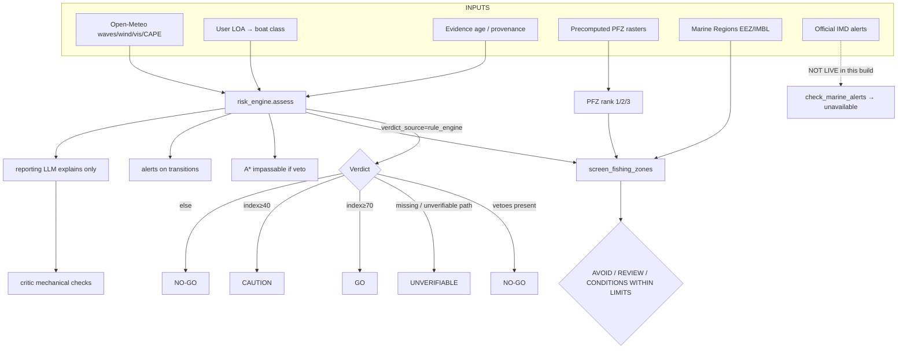
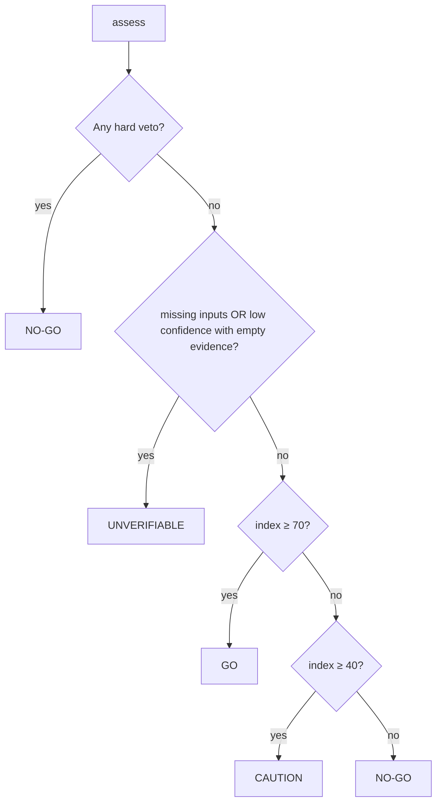
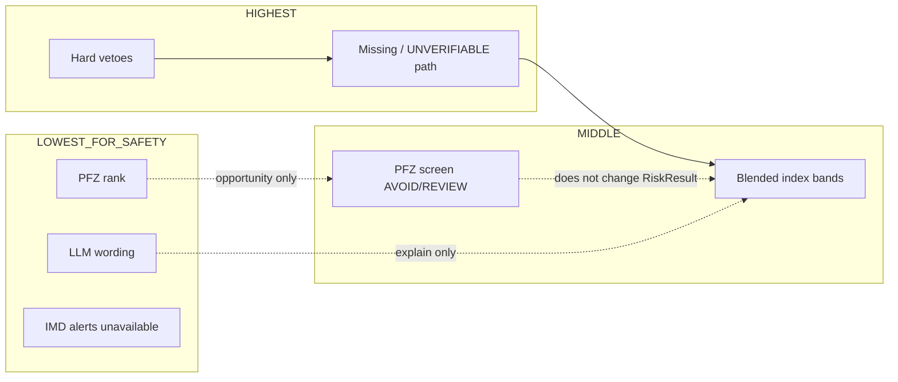
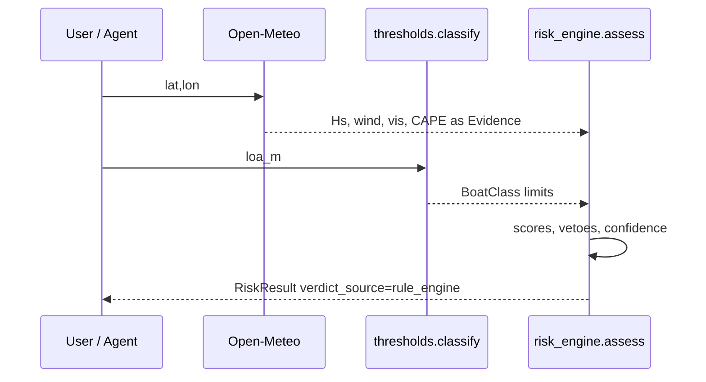
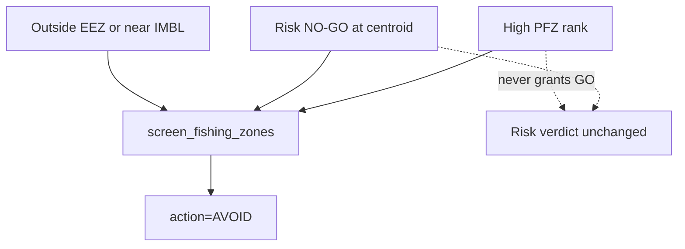
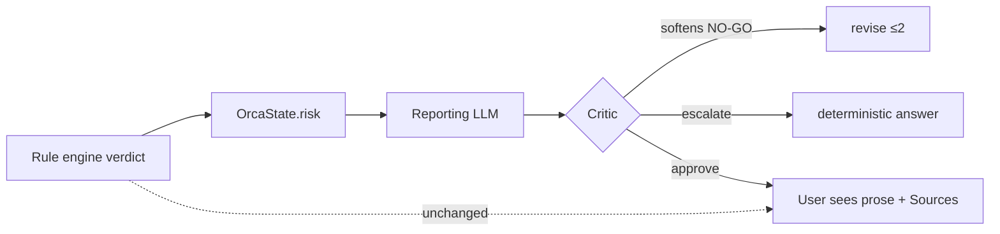

# ORCA Decision Logic Audit

**Purpose:** Document exactly how ORCA currently makes decisions that affect answers  
and safety-adjacent outputs.  
**Rule:** Code is the source of truth. No code was modified. No improvements proposed.  
**Companion:** `docs/ORCA_SYSTEM_FLOW.md`, `docs/ORCA_ARCHITECTURE.mmd`  
**Branch context:** operational-intelligence adapters lineage  
**Date:** 2026-09-04

---

## Scope of “decision”

A **decision** here is any rule, score, threshold, ranking, or classification that
changes what the user is told, shown, or warned about — including:

1. Safety GO / CAUTION / NO-GO / UNVERIFIABLE  
2. PFZ identification / ranking  
3. Weather / wave / wind severity (as inputs to risk)  
4. Geofence / restricted-area actions  
5. Government-warning handling  
6. Evidence / confidence / escalation  
7. Priority when signals conflict  
8. Agent critic approve / revise / escalate (affects final prose, not the verdict type)

---

## 1. Master decision pipeline

**Critical invariant:** `RiskResult.verdict_source` is typed `Literal["rule_engine"]`.  
The LLM **cannot** emit a typed safety verdict.

---

## 2. Safety / GO / NO-GO decisions

### 2.1 Boat class selection

| Field | Value |
|-------|-------|
| File | `backend/orca/services/thresholds.py` |
| Function | `classify(loa_m)` |
| Inputs | vessel length overall (m) from UI / agent state |
| Outputs | `BoatClass` with `max_wave_m`, `max_wind_kn`, `min_visibility_km` |
| Formula | Half-open LOA intervals; OOR clamps to nearest class (too-small → smallest) |
| Thresholds | See table below |
| Units | m, kn, km |
| Source of thresholds | Literature-seeded (JMSE doi:10.3390/jmse11071302) + IMD warning band conventions; **explicitly not** published INCOIS SVAS numbers |
| Justified? | Partially — citations present; not official INCOIS values |
| Hardcoded? | **Yes** (versioned table `orca-thresholds-2026.08`) |
| Data-driven? | No (static config) |
| Needs user info? | **Yes** — LOA; wrong LOA → wrong class → wrong verdict |
| Deterministic? | **Yes** |

| Code | LOA (m) | max Hs (m) | max wind (kn) | min vis (km) |
|------|---------|------------|---------------|--------------|
| IND-TRAD | [0,7) | 1.0 | 15 | 2.0 |
| IND-MOT-S | [7,10) | 1.5 | 22 | 2.0 |
| IND-MECH-S | [10,15) | 2.0 | 28 | 1.0 |
| IND-MECH-L | [15,24) | 2.5 | 33 | 1.0 |
| IND-DEEPSEA | [24,1000) | 3.5 | 40 | 0.5 |

---

### 2.2 Component scores

| Field | Value |
|-------|-------|
| File | `backend/orca/services/risk_engine.py` |
| Functions | `_score_wave`, `_score_wind`, `_score_visibility`, `_score_lightning` |
| Deterministic? | **Yes** · LLM? **No** |

**Wave / wind (quadratic):**
\[
S = \max\bigl(0,\ 100\bigl(1 - (x / x_{\lim})^2\bigr)\bigr)
\]
Units: wave m; wind kn.

**Visibility (linear cap):**
\[
S_v = \min(100,\ V_{\mathrm{km}}/10 \times 100)
\]
Cap at 10 km is **hardcoded engineering judgment**.

**Lightning score:**
\[
S_\ell = \max(0,\ 100 - L)\quad (L\ \mathrm{in\ \%})
\]

---

### 2.3 CAPE → lightning proxy

| Field | Value |
|-------|-------|
| File | `risk_engine.py` → `cape_to_lightning_pct` |
| Constant | `CAPE_VETO_J_KG = 2500` in `thresholds.py` |
| Formula | \(C\le300→0\%\); \(C\ge2500→100\%\); else linear between |
| Units | CAPE J/kg → % |
| Source | NOAA-style instability bands (cited); **not** lightning observation |
| Justified as lightning? | **No** — labelled proxy everywhere |
| Hardcoded? | **Yes** |
| Potentially dangerous if misread? | **Yes** — monsoon CAPE often high → frequent vetoes that look like “storms” |

---

### 2.4 Blended index and verdict

| Field | Value |
|-------|-------|
| File | `risk_engine.py` → `assess` |
| Weights | wave 0.35, wind 0.30, visibility 0.15, lightning 0.20 (**hardcoded**) |
| Index | \(I = \sum w_i S_i\) |
| Bands | GO if \(I\ge70\); CAUTION if \(I\ge40\); else NO-GO |
| Hardcoded bands? | **Yes** (`GO_THRESHOLD`, `CAUTION_THRESHOLD`) |

**Verdict priority (actual code order):**

**Hard vetoes (override blended score completely):**

| Condition | Threshold | Unit |
|-----------|-----------|------|
| \(H_s \ge H_{\lim}\) | boat class | m |
| \(U \ge U_{\lim}\) | boat class | kn |
| \(V &lt; V_{\min}\) | boat class | km |
| \(L \ge 60\) | `LIGHTNING_VETO_PCT` | % (CAPE-derived) |

**Missing inputs:** score as 0 (cautious) **and** set low confidence; may force UNVERIFIABLE.

**Entry points:**

| Caller | File |
|--------|------|
| `POST /risk/assess` | `api/routes/forecast.py` |
| Agent tools `assess_risk`, `assess_forecast_risk`, `screen_fishing_zones` | `agents/tools.py` |
| Router cell costing | `services/router.py` |
| Trip monitor | `jobs/monitor.py` |
| Wrapper | `assess_from_evidence` — drops non–decision-grade Evidence; vis m→km |

---

## 3. Weather severity / wave / wind risk

ORCA does **not** have a separate “weather severity” classifier.

Severity enters decisions **only** as:

1. Raw Open-Meteo values → risk scores / vetoes  
2. Forecast window worst-hour assessment (`assess_forecast_risk`: tomorrow 05–11 IST)  
3. Monitor index-drop alerts (`INDEX_DROP_ALERT = 12` points within same verdict band)

| Signal | Decision role | Deterministic |
|--------|---------------|---------------|
| Wave height | score + hard veto | Yes |
| Wind speed | score + hard veto | Yes |
| Visibility | score + hard veto | Yes |
| CAPE | proxy % + hard veto at 60% | Yes |
| Precipitation / gusts | fetched; **not used in assess()** | N/A |

**UNSUPPORTED ASSUMPTION:** “weather severity” beyond these four variables is not decided by the engine.

---

## 4. PFZ identification and ranking

### 4.1 Rank derivation

| Field | Value |
|-------|-------|
| File | `backend/orca/science/pfz.py` → `derive`, `_drop_specks`, `polygonise` |
| Fronts | `science/fronts.py` → `detect` / `sobel_fronts` (default) |
| Trigger | `jobs/ingest.run_ingest` (not live inside chat) |
| Deterministic? | **Yes** · LLM? **No** |

**Rank rule (implemented):**

| Rank | Condition |
|------|-----------|
| 0 | no front / non-finite SST / speck removed |
| 1 | thermal **or** chlorophyll front |
| 2 | front + (eddy XOR productive) |
| 3 | front + eddy **and** productive |

| Constant | Value | Unit | Source claim |
|----------|-------|------|--------------|
| `CHLOROPHYLL_THRESHOLD` | 0.3 | mg m⁻³ | Cited as INCOIS method |
| `EDDY_SSHA_THRESHOLD` | 0.08 | m | Hardcoded ORCA |
| `MIN_ZONE_CELLS` | 12 | cells | Hardcoded ORCA |
| Sobel percentile | 90 | — | Hardcoded heuristic |
| Canny σ | 2.0 | — | Claimed INCOIS detector |

**Polygonization:** `skimage.measure.find_contours` at 0.5 on padded mask → lon/lat ring → H3 res 6.

**Not implemented:** Ekman advection (docstring only).  
**Ingest typically omits SSHA** → rank-3 path often unreachable.

### 4.2 Agent use of PFZ

| Tool | Decision |
|------|----------|
| `find_fishing_zones` | Nearest zones by geodesic; reports rank; **does not** change safety verdict |
| `screen_fishing_zones` | Combines PFZ + risk + geofence → **AVOID / REVIEW / CONDITIONS WITHIN LIMITS** |

**Explicit product rule in code:** PFZ rank is an **opportunity** signal, never a hazard label or GO clearance.

---

## 5. Geofence / restricted-area decisions

| Field | Value |
|-------|-------|
| File | `backend/orca/services/geofence.py` |
| Class | `GeofenceIndex` · `FenceState` · `check` |
| Geometry | Marine Regions EEZ / IMBL (CURATED) |
| Deterministic? | **Yes** |

| Constant | Value | Meaning |
|----------|-------|---------|
| `APPROACHING_M` | 3704 m (2 NM) | Approaching band |
| `PROJECTION_HOURS` | 6 | Optional track projection for time-to-cross |

**States:** `outside` → `approaching` → `crossed` / `inside` → `exited`  
**Transition rule:** `CROSSED` only if previous was outside/approaching (first fix inside → `INSIDE`, not crossed).

### 5.1 Screening actions (`screen_fishing_zones`)

| Condition | Action |
|-----------|--------|
| Outside India EEZ **or** risk NO-GO **or** (IMBL ≤ 25 km listed as restriction) | **AVOID** |
| risk CAUTION/UNVERIFIABLE **or** EEZ check failed | **REVIEW** |
| else | **CONDITIONS WITHIN LIMITS** |

IMBL ≤ **25 km** restriction for screening is **hardcoded** in `tools.py` (separate from 2 NM approaching).

**Geofence alone does not change `RiskResult.verdict`.** It affects screening actions, UI boundary panel, monitor alerts, and CAP tooling.

---

## 6. Government-warning handling

| Field | Value |
|-------|-------|
| File | `agents/tools.py` → `_check_marine_alerts` |
| Intended | Verify IMD lightning / cyclone / fishermen warnings |
| Actual | Always returns **unavailable** evidence for IMD products in this build |
| CAPE | May still be attached as proxy context |
| `ok` | Tool returns failure-style unavailable path |
| Auth | `IMD_API_KEY` may be set; adapter **not enabled** |
| Deterministic? | Yes (fixed unavailable result) |
| LLM? | Must disclose cannot verify (prompt + critic) |

**Decision effect today:** cannot confirm or deny official warnings.  
Prompts instruct: say “cannot verify”, **never** “there are no warnings”.

---

## 7. Evidence / confidence scoring

### 7.1 Provenance gate

| Field | Value |
|-------|-------|
| File | `backend/orca/provenance.py` |
| Decision-grade | LIVE, CACHED, CURATED, DERIVED only |
| Excluded | SIMULATED (cannot support safety verdict) |
| Staleness | per-variable hours table (`STALENESS_HOURS`) |

`assess_from_evidence` **ignores** non–decision-grade or null values as if missing.

### 7.2 Confidence in risk engine

| Field | Value |
|-------|-------|
| File | `risk_engine.assess` |
| Levels | `"high"` \| `"low"` only (no numeric 0–1 confidence) |
| Low if | data age &gt; **6 h** (`CONFIDENCE_AGE_LIMIT_H`); missing inputs; any SIMULATED; evidence present but none decision-grade |
| Output | `escalate=True` + fisheries-office / VHF message |

**Note:** Low confidence does **not** always force UNVERIFIABLE if evidence exists and no missing path triggers that branch; escalate message is still attached. Exact coupling: UNVERIFIABLE when `missing` **or** `(confidence=="low" and not evidence)`.

### 7.3 Critic (answer quality, not safety number)

| File | `agents/graph.py` → `critic` |
| LLM? | **No** |
| Effect | Can force rewrite of prose; on escalate after 2 rounds replaces draft with `_deterministic_answer` |
| Does not | Recompute `RiskResult` |

---

## 8. Priority ordering when signals conflict

**Actual precedence (safety verdict):**

1. **Hard vetoes** beat blended index (good weather elsewhere cannot cancel an exceeded limit).  
2. **UNVERIFIABLE** path when required inputs missing / unverifiable edge cases.  
3. Else **index bands** GO / CAUTION / NO-GO.  
4. **SIMULATED** evidence cannot support decision-grade inputs.  
5. **LLM prose** cannot override verdict; critic rejects softening of NO-GO.  
6. **PFZ high rank** never upgrades GO; screening can only add AVOID/REVIEW.  
7. **Geofence** does not veto the risk index; it restricts zone screening / alerts.  
8. **Official IMD alerts** currently contribute **no positive or negative safety bit** (unavailable).  
9. **Router:** vetoed cell = impassable (infinite / blocked), not a large cost — cannot “pay” to cross.  
10. **Monitor:** alerts on **transitions** only; severity ranked GO &lt; CAUTION &lt; UNVERIFIABLE &lt; NO-GO.

---

## 9. Per-rule catalogue (condensed)

| Decision | File · symbol | Inputs → outputs | Formula / threshold | Threshold source | Hardcoded | Data-driven | Needs user info | Det. / LLM |
|----------|---------------|------------------|---------------------|------------------|-----------|-------------|-----------------|------------|
| Boat class | `thresholds.classify` | LOA → class limits | LOA bins | Lit + IMD conventions | Y | N | LOA | Det |
| Wave score | `risk_engine._score_wave` | Hs, limit → 0–100 | quadratic | Engineering | Y | Live Hs | LOA for limit | Det |
| Wind score | `_score_wind` | kn, limit → 0–100 | quadratic | Eng + IMD bands | Y | Live wind | LOA | Det |
| Vis score | `_score_visibility` | km → 0–100 | /10, cap 100 | Engineering | Y | Live vis | — | Det |
| Lightning score | `_score_lightning` | % → 0–100 | 100−L | Engineering | Y | CAPE proxy | — | Det |
| CAPE proxy | `cape_to_lightning_pct` | J/kg → % | 300…2500 | NOAA-ish | Y | Live CAPE | — | Det |
| Index | `assess` | scores → I | weighted sum | Hardcoded weights | Y | — | — | Det |
| Verdict bands | `assess` | I → GO/CAU/NGO | 70 / 40 | Hardcoded | Y | — | — | Det |
| Hard vetoes | `assess` | vars vs limits | ≥ / &lt; | Boat + 60% | Y | Live | LOA | Det |
| Confidence | `assess` | age/missing/sim | 6 h | Hardcoded | Y | Evidence meta | — | Det |
| PFZ rank | `pfz.derive` | SST/chl/SSHA → 1–3 | front+indicators | Mixed INCOIS claim / ORCA | Y | Satellite grids | — | Det |
| PFZ speck drop | `_drop_specks` | rank field | &lt;12 cells | ORCA | Y | — | — | Det |
| Zone polygons | `polygonise` | mask → rings | find_contours 0.5 | Library method | Y | — | — | Det |
| Screen action | `_screen_fishing_zones` | risk+fence → AVOID… | EEZ / IMBL≤25 / NO-GO | Hardcoded 25 km | Y | Live+curated | LOA | Det |
| Fence approach | `geofence` | distance → state | 2 NM | Hardcoded | Y | Curated geo | heading/speed optional | Det |
| Route impassable | `router.cost_lattice` | risk vetoes | passable=False | Risk engine | via RE | Live lattice | LOA | Det |
| Route cost | `router._penalty` | index → multiplier | \(1+4((100-I)/100)^2\) | Hardcoded 4 | Y | — | — | Det |
| Official alerts | `_check_marine_alerts` | — → unavailable | N/A | Missing adapter | Stub | N | — | Det stub |
| Productivity cause | `_diagnose_productivity` | — → refusal | N/A | Unsupported | Stub | N | — | Det stub |
| Critic revise | `graph.critic` | draft vs risk | string/figure rules | Product policy | Y | — | — | Det |
| Planner tools | `graph.planner` | question → tool list | LLM JSON | Prompt rules | Partial | — | question | **LLM** (+ det fallback) |
| Answer prose | `graph.reporting` | tools → draft | LLM | Prompt | — | tools | — | **LLM** (+ det fallback) |

---

## 10. Decision flowcharts (focused)

### 10.1 Point safety (map click or `assess_risk`)

### 10.2 Conflicting “good fishing / bad sea”

### 10.3 Agent final answer vs verdict

---

## 11. Final classification table

| Category | Items found in current implementation |
|----------|----------------------------------------|
| **IMPLEMENTED** | Deterministic risk engine; boat-class hard vetoes; blended index; CAPE lightning proxy; confidence/escalation flags; PFZ rank+polygonise; A* passability from vetoes; geofence state machine; PFZ screening AVOID/REVIEW; monitor transition alerts; critic mechanical checks; `verdict_source=rule_engine` type lock |
| **PARTIALLY IMPLEMENTED** | PFZ (ingest-dependent; SSHA/rank-3 weak; no Ekman advection); geofence→CAP (`from_geofence` not wired to live CAP HTTP); official alert **disclosure** path without live IMD; LLM planner/reporting with deterministic fallbacks; ui_spec layers vs safety |
| **HARDCODED** | Score weights; GO/CAUTION cutoffs; lightning 60%; CAPE 300/2500; vis/10; boat table; DETOUR_WEIGHT; lattice step; PFZ chl 0.3 / SSHA 0.08 / min 12 cells; Sobel P90; screen IMBL 25 km; approach 2 NM; INDEX_DROP 12; CONFIDENCE 6 h |
| **UNSUPPORTED ASSUMPTION** | CAPE% behaves like actionable lightning/thunderstorm occurrence; missing input scored 0 is “safe direction” for blending before UNVERIFIABLE gate; 25 km IMBL buffer equals operational restricted zone; PFZ methodology fully matches INCOIS without bulletin validation in this audit |
| **MISSING DATA** | Live IMD marine/cyclone/lightning APIs; published INCOIS SVAS numeric thresholds; free authoritative Indian lightning; often SSHA for PFZ; WorldTides/AIS/GFW when keys absent; agent destination for `plan_route` from graph state |
| **POTENTIALLY DANGEROUS LOGIC** | CAPE proxy vetoes can blanket-refuse monsoon coasts while sounding like storm detection if UI/prose is skimmed; wrong LOA silently changes class; UNVERIFIABLE vs NO-GO distinction fails if user only reads colour; PFZ “CONDITIONS WITHIN LIMITS” is **not** a trip clearance but can be misread; router coarsening makes vetoes block wider corridors (conservative but may look like “no path” when a finer corridor exists); no archived evidence replay after restart |
| **NOT CURRENTLY JUSTIFIABLE** | Claiming official IMD warning status (adapter unavailable); claiming INCOIS-authored numeric thresholds; treating PFZ rank as safety advice; lightning **detection**; productivity causal diagnosis; Ekman-advected PFZ positions |

---

## 12. What does *not* decide safety (explicit)

| Mechanism | Role |
|-----------|------|
| LangGraph planner / reporting LLM | Tool choice and prose only |
| Critic | Prose consistency with rule engine |
| PFZ rank | Fishing opportunity |
| deck.gl layers / treatments | Visualization |
| Redis / PostGIS probes | Infra labels, not verdicts |
| SAR Monte Carlo | Search area, not GO/NO-GO |
| Satellite overpass / GIBS previews | Ops intel, not safety |

---

## 13. File index for decision code

| Concern | Path |
|---------|------|
| Verdict | `backend/orca/services/risk_engine.py` |
| Thresholds | `backend/orca/services/thresholds.py` |
| Provenance / decision-grade | `backend/orca/provenance.py` |
| PFZ | `backend/orca/science/pfz.py`, `fronts.py` |
| Routing decisions | `backend/orca/services/router.py` |
| Geofence | `backend/orca/services/geofence.py` |
| Screening / alerts stub | `backend/orca/agents/tools.py` |
| Critic / reporting | `backend/orca/agents/graph.py`, `prompts.py` |
| Monitor transitions | `backend/orca/jobs/monitor.py` |
| Ingest PFZ | `backend/orca/jobs/ingest.py` |

---

*End of decision logic audit. No architectural changes recommended in this document by design.*
