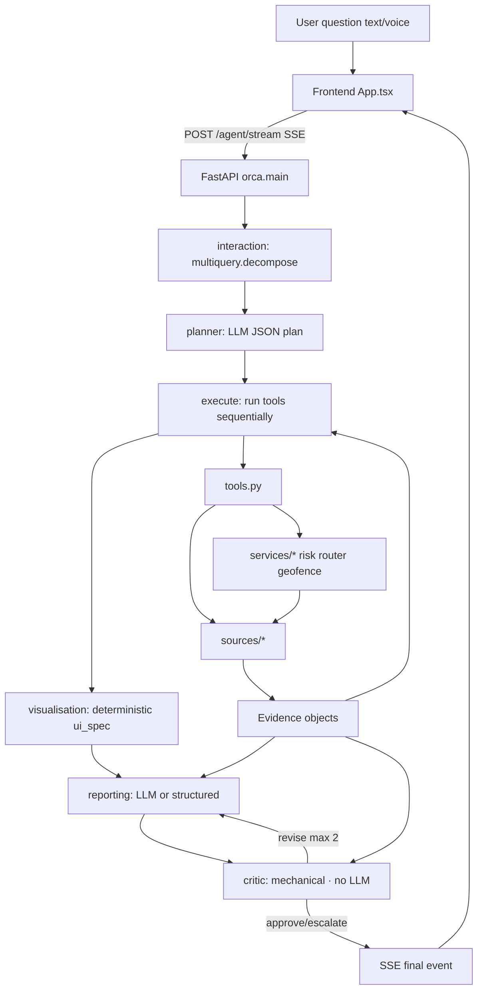
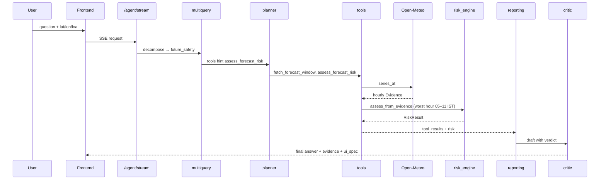
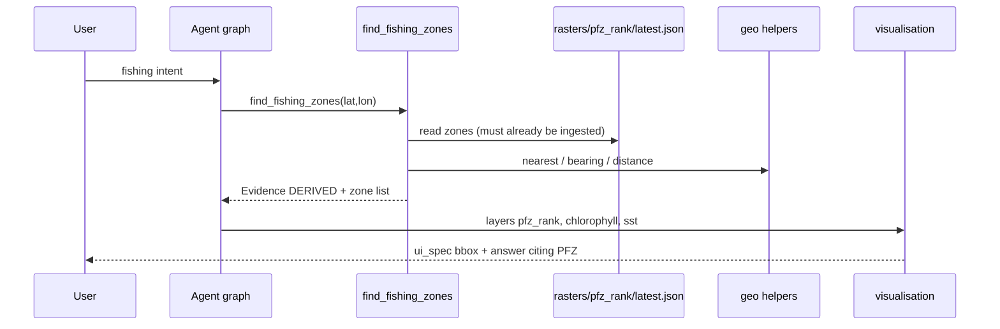
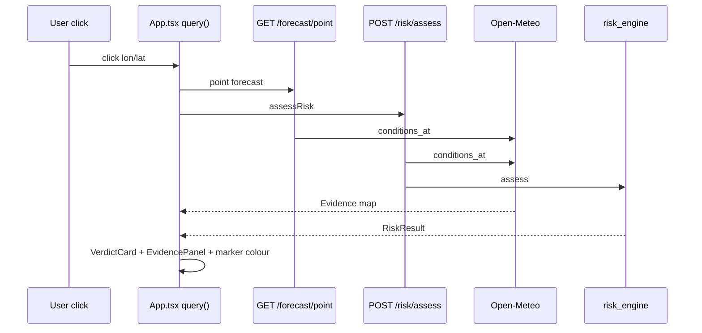
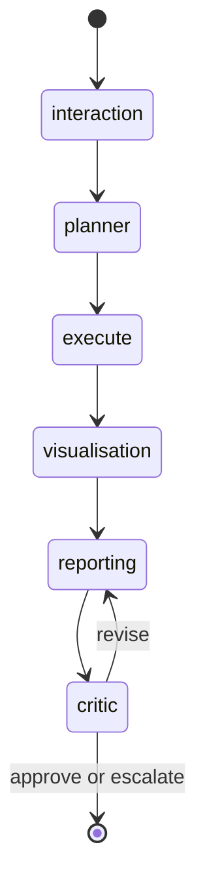

# ORCA System Flow — Reverse-Engineered Architecture

**Status:** documentation of the **current implementation** on branch
`feature/operational-intelligence-adapters` (and continuations thereof).  
**Rule:** the code is the source of truth. Claims here are grounded in
repository files. Where something cannot be determined: **UNKNOWN FROM CURRENT
REPOSITORY**.  
**Companion Mermaid file:** [`ORCA_ARCHITECTURE.mmd`](./ORCA_ARCHITECTURE.mmd)  
**Date of reverse-engineering:** 2026-09-03  
**No code was modified while producing this document.**

---

## Table of contents

1. [Complete end-to-end flow](#1-complete-end-to-end-flow)
2. [Agent / node breakdown](#2-agent--node-breakdown)
3. [Mathematics and scientific logic](#3-mathematics-and-scientific-logic)
4. [Data / API map](#4-data--api-map)
5. [Data format pipeline](#5-data-format-pipeline)
6. [Database / storage architecture](#6-database--storage-architecture)
7. [Scientific / decision pipeline (3 examples)](#7-scientific--decision-pipeline-3-examples)
8. [Evidence and provenance](#8-evidence-and-provenance)
9. [Map / visualization flow](#9-map--visualization-flow)
10. [LangGraph state machine](#10-langgraph-state-machine)
11. [Reality check](#11-reality-check)
12. [Unknown / not determinable](#12-unknown--not-determinable)
13. [File-level traceability](#13-file-level-traceability)

---

## 1. Complete end-to-end flow

### 1.1 Master architecture (implementation)



**Important correction vs the conceptual “many specialist agents” diagram:**  
the **compiled LangGraph has six linear nodes** (`interaction → planner →
execute → visualisation → reporting → critic`). Tool metadata tags
(`owner: weather|ocean|…`) are **not** separate graph nodes.

Master Mermaid file: `docs/ORCA_ARCHITECTURE.mmd`.

### 1.2 Arrow-by-arrow data contracts

| From → To | Payload / contract |
|-----------|-------------------|
| User → Frontend | Natural-language question; optional mic → WAV → `POST /language/listen` |
| Frontend → Backend | `POST /agent/stream` body: `question`, `lat`, `lon`, `loa_m`, optional `place`, `reply_language`, `speak` (`api/routes/agent.py`) |
| Backend → Frontend (SSE) | Incremental events: plan steps, tool_call/tool_result, ui_spec, draft/critic, then `final` with `answer`, `risk`, `evidence[]`, `ui_spec`, `citations` |
| interaction → planner | `decomposition` (`parts`, `tools`, intents) + `events` |
| planner → execute | `plan: [{id, tool, why, status}]`, `plan_rationale`, `llm_provider` |
| execute → visualisation | `tool_results[]`, `evidence[]`, optional `risk` dict |
| visualisation → reporting | `ui_spec: {camera, bbox, layers, charts, card}` |
| reporting → critic | `draft` markdown string |
| critic → reporting (revise) | `critic_verdict="revise"`, `critic_reason`, `critic_rounds` |
| critic → END | `answer` (cleaned + Sources), `critic_verdict` |
| Tool → Source | kwargs always include `lat`, `lon`, `loa_m` from state (route destination kwargs **not** injected from graph state — see §12) |
| Source → Tool | Values wrapped as `Evidence` + `ToolResult.data` |
| Risk engine → Tool / API | `RiskResult` with `verdict`, `index`, `vetoes`, `scores`, `verdict_source="rule_engine"` |
| ui_spec → Frontend | `App.tsx` flies map to `bbox`; layer toggles are **not** auto-driven solely by ui_spec names in all cases — map also uses user `activeLayers` |

### 1.3 Parallel non-agent paths (same UI)

These do **not** go through LangGraph:

| UI action | Endpoint | Service |
|-----------|----------|---------|
| Click sea | `GET /forecast/point` + `POST /risk/assess` | Open-Meteo + `risk_engine` |
| Plan passage | `POST /route/plan` | `services.router.plan` |
| SAR drift | `POST /sar/drift` | `services.drift.simulate` |
| Boundary panel | `POST /geofence/check` | `services.geofence` |
| Layer refresh | `POST /rasters/refresh` | `jobs.ingest.run_ingest` |
| Alerts | `/alerts/*` SSE | `jobs.monitor` |

---

## 2. Agent / node breakdown

### 2.1 Graph topology

**File:** `backend/orca/agents/graph.py`  
**Builder:** `build_graph()` / `compiled_graph()` / `run()`

| Edge | Condition |
|------|-----------|
| `interaction` → `planner` | always |
| `planner` → `execute` | always |
| `execute` → `visualisation` | always |
| `visualisation` → `reporting` | always |
| `reporting` → `critic` | always |
| `critic` → `reporting` | `state["critic_verdict"] == "revise"` |
| `critic` → `END` | otherwise |

`MAX_CRITIC_ROUNDS = 2`.

---

### 2.2 Node: `interaction`

| Field | Value |
|-------|-------|
| Source | `backend/orca/agents/graph.py` → `async def interaction` |
| Helper | `backend/orca/agents/multiquery.py` → `async def decompose` |
| Trigger | Graph entry |
| Input | `question`, `lat`, `lon`, `loa_m`, … |
| Output | `decomposition`, `events`, `critic_rounds=0` |
| LLM? | Yes (optional) via `llm.complete` inside `decompose`; T=0.0 |
| Deterministic fallback | `split_heuristic` + keyword `_HINTS` / intent classifiers |
| Next | `planner` |

**Intent → default tools** (`INTENT_TOOLS` in `multiquery.py`):

| Intent | Tools |
|--------|-------|
| `safety` | `fetch_marine_conditions`, `assess_risk` |
| `future_safety` | `fetch_forecast_window`, `assess_forecast_risk` |
| `conditions` | `fetch_marine_conditions`, `fetch_tides` |
| `alerts` | `check_marine_alerts` |
| `forecast` | `fetch_forecast_window` |
| `fishing` | `find_fishing_zones`, `fetch_satellite_sst` |
| `restricted_zones` | `screen_fishing_zones` |
| `productivity` | `diagnose_productivity` |
| `routing` | `plan_route` |
| `boundary` | `check_geofences` |
| `provenance` | `discover_datasets` |
| `thresholds` | `lookup_boat_thresholds` |
| `overpass` | `predict_satellite_overpasses` |
| `traffic` | `check_vessel_traffic` |
| `fishing_activity` | `check_fishing_activity` |
| `cross_validation` | `cross_validate_conditions` |
| `location` / `other` | `fetch_marine_conditions` |

---

### 2.3 Node: `planner`

| Field | Value |
|-------|-------|
| Source | `graph.py` → `async def planner` |
| Prompts | `prompts.PLANNER_SYSTEM`, `planner_user(...)` |
| LLM | `llm.complete`, T=0.1, max_tokens=700 |
| Provider chain | Groq primary → Groq fallback → Gemini → OpenRouter → Ollama (`agents/llm.py`) |
| Models | `openai/gpt-oss-120b` (Groq), `gemini-3-flash-preview`, `nvidia/nemotron-3-super-120b-a12b:free`, `llama3.1:8b` |
| Instructed to | Choose **minimal** tool set; return JSON `{rationale, steps[{tool,why}]}`; never issue verdicts |
| Deterministic | Filter to catalogue; union/intersect with `decomposition.tools`; sort by `TOOL_ORDER` |
| Fallback | Fixed plan: `fetch_marine_conditions` → `assess_risk` if LLM unavailable / empty plan |
| Output | `plan`, `plan_rationale`, `llm_provider` |
| Next | `execute` |

---

### 2.4 Node: `execute`

| Field | Value |
|-------|-------|
| Source | `graph.py` → `async def execute` |
| Helper | `tools.run_tool` |
| LLM? | **No** |
| Behaviour | Runs each plan step sequentially; updates status pending→running→done/failed |
| Input kwargs to tools | `{lat, lon, loa_m}` from state |
| Output | `tool_results`, `evidence` (appended), `risk` if tool returns `data.risk` |
| Failure | Per-tool `ToolResult(ok=False, error=…)` — does not abort the whole graph |
| Next | `visualisation` |

---

### 2.5 Node: `visualisation`

| Field | Value |
|-------|-------|
| Source | `graph.py` → `async def visualisation` |
| LLM? | **No** — fully deterministic |
| Output | `ui_spec` |
| Layer mapping | marine/forecast → `wave_height`,`wind`; SST → `sst`; PFZ tools → `pfz_rank`,`chlorophyll`,`sst`; geofence/screen → `eez`; risk → `verdict_marker` |
| Camera | `{lat, lon, zoom: 7}`, bbox ±3° |
| Next | `reporting` |

---

### 2.6 Node: `reporting`

| Field | Value |
|-------|-------|
| Source | `graph.py` → `async def reporting` |
| Prompts | `REPORTING_SYSTEM`, `reporting_user(..., references=..., revision_note=...)` |
| LLM | T=0.25, max_tokens=1200 |
| Instructed to | Explain tool results; bold verdict if present; cite `[n]` from REFERENCES only; max ~6–8 sentences; end with `**In short:**` |
| Prefer structured path | `_structured_report` for destination-missing route / screened PFZ cases |
| Fallback | `_deterministic_answer` on `LlmUnavailable` |
| Output | `draft` |
| Next | `critic` |

---

### 2.7 Node: `critic`

| Field | Value |
|-------|-------|
| Source | `graph.py` → `async def critic` |
| LLM? | **No** |
| Checks (mechanical) | Verdict string present; no softener phrases over NO-GO; veto figures quoted within tolerance; disclose tool failure; length/meta filters; stale PFZ must say “stale”; SST favourability phrases; route-destination permission phrases; screen_fishing_zones AVOID count; etc. |
| Outcomes | `approve` (no problems); `revise` (problems and rounds &lt; 2); `escalate` (problems and rounds ≥ 2 → replace with `_deterministic_answer`) |
| Post | `_ensure_human_summary`, `_clean_inline_citations`, `_append_sources` |
| Next | `reporting` or `END` |

---

### 2.8 Tools catalogue (18)

All registered in `backend/orca/agents/tools.py` as `TOOLS` / `TOOL_ORDER`.

| Tool | Calls | Decision-grade? |
|------|-------|-----------------|
| `fetch_marine_conditions` | `open_meteo.conditions_at` | LIVE conditions |
| `fetch_tides` | `worldtides.forecast` | LIVE if `WORLDTIDES_API_KEY` |
| `fetch_forecast_window` | `open_meteo.series_at` | LIVE |
| `assess_forecast_risk` | series + `assess_from_evidence` (tomorrow 05–11 IST worst hour) | rule engine |
| `check_marine_alerts` | settings + CAPE | **Currently returns unavailable / not enabled** in tool body |
| `fetch_satellite_sst` | `erddap.point("mur_sst")` | LIVE |
| `predict_satellite_overpasses` | `services.overpass` + CelesTrak TLE | derived |
| `cross_validate_conditions` | `services.cross_validation.validate_point` | derived |
| `check_vessel_traffic` | `ais.snapshot` | LIVE if AIS key |
| `check_fishing_activity` | `gfw.effort` | LIVE if GFW token |
| `check_geofences` | `geofence.index.check` | CURATED fences |
| `diagnose_productivity` | refusal Evidence only | **not supported** |
| `assess_risk` | Open-Meteo + `assess_from_evidence` | rule engine |
| `lookup_boat_thresholds` | `thresholds.classify` | CURATED table |
| `find_fishing_zones` | reads `data/rasters/pfz_rank/latest.json` | DERIVED (disk) |
| `screen_fishing_zones` | PFZ + conditions + geofences + risk | composite |
| `plan_route` | `services.router.plan` | rule-engine-costed A* |
| `discover_datasets` | in-code `DATASETS` roster | metadata |

---

## 3. Mathematics and scientific logic

### 3.1 Risk engine (`services/risk_engine.py`)

**Type:** hardcoded ORCA policy + literature-seeded boat limits (see thresholds).  
**Caller:** `/risk/assess`, router nodes, agent tools, trip monitor.

**Scores (0–100):**

\[
S_w = \max\bigl(0,\; 100\bigl(1-(H_s/H_{\lim})^2\bigr)\bigr)
\quad (H_s, H_{\lim}\ \mathrm{in\ m})
\]

\[
S_u = \max\bigl(0,\; 100\bigl(1-(U/U_{\lim})^2\bigr)\bigr)
\quad (U, U_{\lim}\ \mathrm{in\ kn})
\]

\[
S_v = \min\bigl(100,\; V_{\mathrm{km}}/10 \times 100\bigr)
\quad (V\ \mathrm{in\ km})
\]

\[
S_\ell = \max(0,\; 100 - L)
\quad (L\ \mathrm{lightning\ proxy\ in\ \%})
\]

**Index:**

\[
I = 0.35 S_w + 0.30 S_u + 0.15 S_v + 0.20 S_\ell
\]

**Verdict:** \(I \ge 70\) → GO; \(I \ge 40\) → CAUTION; else NO-GO.  
Any **hard veto** → NO-GO. Missing critical inputs / low confidence → **UNVERIFIABLE**.

**Hard vetoes:** \(H_s \ge H_{\lim}\); \(U \ge U_{\lim}\); \(V &lt; V_{\min}\); \(L \ge 60\%\).

**CAPE → lightning proxy** (`cape_to_lightning_pct`):

- \(C \le 300\ \mathrm{J/kg}\) → \(L=0\)
- \(C \ge 2500\) → \(L=100\)
- else linear interpolate between 300 and 2500

**Type:** engineering / literature-inspired CAPE bands; **not** an official IMD lightning probability.

`verdict_source` is typed as rule-engine only (LLM cannot set it).

---

### 3.2 Boat thresholds (`services/thresholds.py`)

| code | LOA m | max Hs m | max wind kn | min vis km |
|------|-------|----------|-------------|------------|
| `IND-TRAD` | [0,7) | 1.0 | 15 | 2.0 |
| `IND-MOT-S` | [7,10) | 1.5 | 22 | 2.0 |
| `IND-MECH-S` | [10,15) | 2.0 | 28 | 1.0 |
| `IND-MECH-L` | [15,24) | 2.5 | 33 | 1.0 |
| `IND-DEEPSEA` | [24,1000) | 3.5 | 40 | 0.5 |

**Type:** literature-seeded (citations in code); **not** published INCOIS SVAS numerical thresholds. Version string: `orca-thresholds-2026.08`.

---

### 3.3 Routing (`services/router.py`)

| Item | Value |
|------|-------|
| Lattice | default 0.25° (~28 km), corridor ±1.1° |
| Max nodes | derived from Open-Meteo call budget |
| Land mask | missing `wave_height` → impassable |
| Passable | risk engine has **no vetoes** |
| Edge cost | \(d_{\mathrm{geo}} \times \bigl(1 + 4\bigl((100-I)/100\bigr)^2\bigr)\) |
| Search | 8-connected A*; heuristic = geodesic only |
| Output | path, waypoints, detour %, duration, worst verdict, or structured refusal |

**Type:** engineering A* with deterministic risk costs.

---

### 3.4 PFZ (`science/pfz.py` + `science/fronts.py`)

**Implemented:**

1. Thermal front via `fronts.detect` (default **Sobel** magnitude ≥ P90).
2. Optional chlorophyll: Canny σ=2; productive if chl &gt; **0.3 mg m⁻³**.
3. Optional SSHA: eddy if |SSHA| &gt; **0.08 m**.
4. Rank: front→1; +one of {eddy, productive}→2; +both→3.
5. Drop components &lt; 12 cells; polygonise contours; H3 res 6.

**Documented in docstring but NOT coded:** Ekman current advection of zones.  
**Ingest path** (`jobs/ingest.py`) calls `derive` **without SSHA**, so eddy-driven rank-3 is unused there.

**Type:** claimed INCOIS-inspired reimplementation + ORCA hardcoded constants.

---

### 3.5 SAR drift (`services/drift.py`)

IAMSAR-style Monte Carlo:

\[
\mathbf{u}_{\mathrm{drift}} = \mathbf{u}_{\mathrm{cur}} + \mathbf{b} + \mathrm{DWL}\,\hat{d} + \mathrm{CWL}\,\hat{c}
\]

- DWL \(= a W_{10}+b\), CWL \(= \pm(c W_{10}+d)\); \(W_{10}\) in m/s  
- Default N=2000 particles, 15 min steps  
- Output: 50% / 95% containment polygons — **never a single predicted point**

**Type:** claimed Allen & Plourde leeway taxonomy + engineering defaults.

---

### 3.6 Geofence (`services/geofence.py` + `services/geo.py`)

- Shapely STRtree over Marine Regions fences  
- Distance via WGS84 `pyproj.Geod` (`geo.geodesic_m`)  
- Approaching threshold: **2 NM** (3704 m)  
- Optional heading/speed: project **6 h** forward; time-to-cross minutes  
- States: outside / approaching / crossed / inside / exited  

---

### 3.7 Other science

| Module | Operation | Type |
|--------|-----------|------|
| `fronts.py` | Sobel / Canny / SIED (Otsu) | literature + heuristics |
| `colormap.py` | linear 0–255 colourize; NaN transparent | viz policy |
| `vectorfield.py` | encode u/v into PNG bytes; IDW regrid | engineering |
| `cross_validation.py` | SST/wind/wave agreement tolerances | ORCA allowances |
| `overpass.py` | SGP4-style overpass + swath half-width | mission specs hardcoded |
| `cap_builder.py` | CAP 1.2 XML from risk / geofence | OASIS + ORCA severity map |

---

## 4. Data / API map

Credentials are **env var names only** (never values).

| Tool / consumer | Adapter | Source | Auth env | Endpoint (representative) | Variables | Spat/Temp | Mode | Stored | Downstream |
|-----------------|---------|--------|----------|---------------------------|-----------|-----------|------|--------|------------|
| fetch_marine_conditions, assess_*, router, monitor | `open_meteo.py` | Open-Meteo Marine + Forecast | none | `marine-api.open-meteo.com/v1/marine`, `api.open-meteo.com/v1/forecast` | waves, SST, currents, wind, vis, CAPE… | point / lattice; hourly–forecast | **LIVE** (+ in-process sample **CACHED**) | memory TTL | risk, UI evidence, routing |
| fetch_satellite_sst, ingest SST | `erddap.py` | NOAA CoastWatch MUR | none | `coastwatch.pfeg.noaa.gov/erddap` | sst, sst_uncertainty | ~1 km daily | **LIVE** / HTTP **CACHED** | NetCDF AOI + rasters | Evidence, rasters |
| ingest chlorophyll | `erddap.py` | ESA CCI chl | none | ERDDAP | chlorophyll | monthly / grid | **LIVE** | rasters | PFZ, layers |
| INCOIS archives | `erddap.py` | INCOIS ERDDAP | none | `erddap.incois.gov.in` | historical SST/chl/wind | archive | **CURATED**/climatology | metadata roster | discover_datasets |
| fetch_tides | `worldtides.py` | WorldTides | `WORLDTIDES_API_KEY` | `worldtides.info/api/v3` | tide_height, extremes | point | **LIVE** or dormant | — | agent answer |
| check_vessel_traffic | `ais.py` | AISStream | `AISSTREAM_API_KEY` | `wss://stream.aisstream.io/v0/stream` | ais_position | realtime | **LIVE** | — | ops / agent |
| check_fishing_activity | `gfw.py` | Global Fishing Watch | `GFW_API_TOKEN` | `gateway.api.globalfishingwatch.org/v3/4wings/report` | fishing_effort | ~72h trails | **LIVE** | — | agent |
| CMEMS catalogue / waves | `cmems.py` | Copernicus Marine | `CMEMS_USERNAME`, `CMEMS_PASSWORD` | Toolbox / datasets | waves / catalogue | model | **LIVE** if configured | — | ops API |
| NASA CMR / POWER | `nasa.py` | NASA | Earthdata user/pass for downloads (`EARTHDATA_*`) | CMR / POWER APIs | granules, wind | various | **LIVE** | — | ops |
| imagery previews | `nasa_gibs.py`, `sentinel_hub.py` | GIBS / CDSE | `CDSE_CLIENT_ID`, `CDSE_CLIENT_SECRET` | WMS / Process API | imagery PNG | tiles | **LIVE** | optional cache | UI previews |
| overpasses | `celestrak.py` + `overpass.py` | CelesTrak | none | `celestrak.org/.../gp.php` | TLE | orbital | **LIVE**/2h **CACHED** | memory | overpass tool |
| geofence | `marine_regions.py` | VLIZ WFS | none | `geo.vliz.be/.../wfs` | EEZ, IMBL | polygons/lines | **CURATED** | `data/static/fences.geojson` | geofence, map |
| find_fishing_zones | disk sidecar | ORCA ingest | — | — | pfz_rank zones | AOI | **DERIVED** | `data/rasters/pfz_rank/` | agent, `/pfz/*` |
| check_marine_alerts | — | IMD | `IMD_API_KEY` | — | — | — | **UNAVAILABLE** in current tool | — | agent discloses gap |
| MOSDAC / Bhashini | config only | — | `MOSDAC_*`, `BHASHINI_*` | — | — | — | dormant adapters / flags | — | capability flags |

**LLM:** `GROQ_API_KEY_PRIMARY`, `GROQ_API_KEY`, `GOOGLE_API_KEY`, `OPENROUTER_API_KEY`, `OLLAMA_BASE_URL`  
**Language:** `SARVAM_API_KEY`, `HF_TOKEN`  
**Infra:** `DATABASE_URL`, `REDIS_URL`, `ORCA_DB_DRIVER`, `ORCA_SQLITE_PATH`

---

## 5. Data format pipeline

Formats **actually present** in code paths:

### 5.1 JSON (primary API + Open-Meteo)

```
HTTP JSON → httpx → Python dict → Evidence / Pydantic models
  → FastAPI JSON response → frontend TypeScript types → UI panels
```

### 5.2 NetCDF

```
ERDDAP AOI download → backend/data/cache/*.nc
  → xarray open → regrid (science/grid) → NumPy arrays
  → fronts/pfz/colormap → PNG + JSON sidecar
```

### 5.3 PNG + JSON sidecars (rasters)

```
NumPy field → colormap.colorize / vectorfield.encode
  → data/rasters/<variable>/latest.png + latest.json
  → GET /rasters/... → frontend ImageBitmap → deck.gl BitmapLayer / particles
```

JSON sidecar carries: `variable`, `unit`, `valid_time`, `provenance`, `bounds`, `colormap`, `statistics`, optional `zones` for PFZ.

### 5.4 GeoJSON

```
Marine Regions WFS → GeoJSON → disk cache fences.geojson
  → GeofenceIndex (Shapely) → /geofence/geojson → deck.gl GeoJsonLayer
SAR drift → polygon rings → GeoJSON-ish structures in API / map polygons
```

### 5.5 JPEG (earth textures)

```
NASA GIBS WMS → JPEG → data/static/earth/*.jpg → /imagery/earth/{layer}.jpg → GlobeIntro Three.js
```

### 5.6 TLE text

```
CelesTrak text → parse → overpass geometry predictions → JSON API
```

### 5.7 CAP XML / WAV / audio upload

```
RiskResult → cap_builder → CAP 1.2 XML
TTS → WAV bytes from /language/speak
STT → multipart audio → /language/listen → text
```

### 5.8 Formats referenced but not primary products

- **GeoTIFF / Zarr / Parquet / GRIB / HDF5 as served map products:** not found as primary ORCA outputs.  
- Optional heavy-ingest extras (`earthaccess`, `copernicusmarine`, `rasterio`) may use provider-native formats internally — **UNKNOWN FROM CURRENT REPOSITORY** which paths are exercised in demo without those extras installed.

---

## 6. Database / storage architecture

| Mechanism | Path / config | What is stored | Schema | Accumulates history? | Reproduce old decision? |
|-----------|---------------|----------------|--------|----------------------|-------------------------|
| SQLite file (configured) | `ORCA_SQLITE_PATH` → `backend/data/orca.db` | **No CREATE TABLE / ORM usage found** | — | No | No |
| Agent checkpoint SQLite | `backend/data/checkpoints/agent.sqlite` | Dir created; **no writer found for run replay tables** | — | No | In-process ring buffer only (`/agent/runs`) — **lost on restart** |
| PostGIS | `DATABASE_URL` | Probed for extension; **no SQL feature store found** | — | No | No |
| Redis | `REDIS_URL` | Ping only; **no cache/queue ops found** | — | No | No |
| In-process | — | HTTP ETag cache; Open-Meteo samples; TLE; alerts deque; health registry; agent run ring (~60) | dicts/deques | Session only | Until restart |
| Raster FS | `backend/data/rasters/<var>/` | PNG+JSON; keep ~12 timestamped | sidecar schema §5.3 | Yes (trimmed) | Can re-show old raster files; **not** tied to agent answers |
| NetCDF cache | `backend/data/cache/` | AOI subsets | NetCDF | Working cache | No decision archive |
| Static | `backend/data/static/` | fences.geojson, earth JPEGs | GeoJSON / JPEG | Manual | CURATED geography |

**Conclusion:** ORCA is **demo-grade ephemeral** for agent traces and alerts. Raster sidecars are the main on-disk scientific products. Full decision archival with evidence replay is **not** implemented.

---

## 7. Scientific / decision pipeline (3 examples)

### Example A — “Is it safe to fish tomorrow?”



**Path notes:** Intent `future_safety` prefers forecast risk, not current `assess_risk`. Critic requires verdict string and veto figures.

---

### Example B — “Where is the nearest PFZ?”



**If ingest never ran:** tool returns stale/unavailable style result — PFZ is **not** computed live inside the agent.

---

### Example C — “What are the wave/weather conditions?” (map click, non-agent)



---

## 8. Evidence and provenance

### 8.1 Core types (`backend/orca/provenance.py`)

| Type | Role |
|------|------|
| `Provenance` | `live \| cached \| curated \| derived \| simulated \| unavailable` |
| `Provider` | enum of upstream organisations |
| `Freshness` | `valid_time`, age hours, `is_stale` vs `STALENESS_HOURS` table |
| `Citation` | label, provider, url, identifier |
| `Evidence` | dataset_id, provider, variable, value, unit, provenance, freshness, lineage, citations… |
| `DECISION_GRADE` | LIVE, CACHED, CURATED, DERIVED only (SIMULATED excluded) |

### 8.2 How evidence reaches the answer

1. Source adapters construct `Evidence`.  
2. Tools attach `evidence: list[Evidence]` on `ToolResult`.  
3. `execute` appends into `OrcaState.evidence`.  
4. `reporting` builds numbered REFERENCES (`_collect_references`, max 8) for the LLM.  
5. Critic strips invented `[n]` and appends `**Sources:**`.  
6. SSE `final` includes `evidence` dumps + `evidence_summary`.

### 8.3 Critic verification (not statistical confidence)

Critic does **not** re-fetch APIs. It checks textual consistency against `risk` / tool_results / evidence flags (stale, AVOID counts, etc.). There is generally **no numeric “confidence score” field** required on Evidence beyond freshness/staleness — **UNKNOWN FROM CURRENT REPOSITORY** for a separate ML confidence channel.

### 8.4 Complete example (conceptual, shapes from code)

**Raw Open-Meteo JSON (representative):**  
`{"hourly":{"time":[...],"wave_height":[1.54],...}}`

**→ Evidence:**
```json
{
  "dataset_id": "open_meteo_marine",
  "provider": "Open-Meteo",
  "variable": "wave_height",
  "value": 1.54,
  "unit": "m",
  "provenance": "live",
  "freshness": {"valid_time": "...", "age_hours": 0.2, "is_stale": false}
}
```

**→ risk_engine:** uses 1.54 m vs boat `max_wave_m` → score/veto/index.

**→ reporting draft (example shape):**  
`**CAUTION** — significant wave height is **1.54 m** against your 1.5 m class limit [1].`

**→ Sources footer:** citation label/url from Evidence.citations.

---

## 9. Map / visualization flow

### 9.1 Stack

| Piece | Library / file |
|-------|----------------|
| Map | MapLibre GL v5 — `components/OceanMap.tsx` |
| Overlay | deck.gl v9 — layers built in `App.tsx` |
| 3D sea / intro | Three.js + R3F — `scenes/SeaState.tsx`, `GlobeIntro.tsx` |
| CRS | WGS84 lon/lat (EPSG:4326); deck bounds `[west,south,east,north]` |
| Basemap | OpenFreeMap dark style via `lib/basemap.ts` |

### 9.2 PFZ map path (actual)

```
jobs/ingest → pfz.derive → colormap PNG + zones JSON
  → GET /rasters/catalogue + /pfz/zones
  → useRasterImages → BitmapLayer(pfz_rank)
  → PolygonLayer outlines for rank≥2
```

Agent `ui_spec.layers` may list `pfz_rank`; frontend also requires user layer toggles / catalogue presence.

### 9.3 Agent → map

`App.tsx` watches `agentRun.final.ui_spec.bbox` and calls `mapRef.flyToBox(...)`.

### 9.4 Route / SAR overlays

- Route: PathLayer + ScatterplotLayer from `RoutePlan`  
- SAR: PolygonLayer containment + PathLayer track from `DriftPlan`  
- Fences: GeoJsonLayer EEZ (muted) + IMBL (amber)

---

## 10. LangGraph state machine

### 10.1 `OrcaState` fields (`graph.py`)

| Field | Type | Created by | Modified by | Read by | Persisted? |
|-------|------|------------|-------------|---------|------------|
| `question` | str | `run()` input | — | planner, reporting | No (in-memory run) |
| `locale` | str | input | — | reporting/language | No |
| `lat`,`lon` | float | input | — | execute tools, visualisation | No |
| `place` | str\|None | input | — | reporting | No |
| `loa_m` | float | input | — | tools | No |
| `decomposition` | dict | interaction | — | planner | No |
| `plan` | list[PlanStep] | planner | execute (status) | execute, final | No |
| `plan_rationale` | str | planner | — | final/UI | No |
| `tool_results` | list[dict] (append) | execute | execute | visualisation, reporting, critic | No |
| `evidence` | list[Evidence] (append) | execute | execute | reporting, critic, final | No |
| `events` | list[dict] (append) | all nodes | all | SSE stream | Ring buffer |
| `draft` | str | reporting | critic (replace on escalate) | critic | No |
| `answer` | str | critic | — | final SSE | Ring buffer |
| `ui_spec` | dict | visualisation | — | frontend | Ring buffer |
| `critic_rounds` | int | interaction/critic | critic | critic | No |
| `critic_verdict` | str | critic | critic | router edge | No |
| `critic_reason` | str | critic | critic | reporting revision | No |
| `llm_provider` | str | planner/reporting | — | observability | No |
| `risk` | dict\|None | execute | execute | visualisation, reporting, critic | Ring buffer |

Example `PlanStep`: `{id:0, tool:"assess_risk", why:"…", status:"done"}`.

### 10.2 Transitions



---

## 11. Reality check

### A. ACTUALLY IMPLEMENTED

- FastAPI surface for forecast, risk, agent SSE, routing, SAR, geofence, rasters/PFZ, alerts, language, ops intel routes  
- Deterministic risk engine + boat thresholds + CAPE lightning proxy  
- LangGraph 6-node agent with planner / tools / critic  
- Open-Meteo live conditions as primary weather/ocean feed  
- A* safe-passage router costed by risk engine  
- Monte Carlo SAR drift API + UI  
- Geofence STRtree + proximity / time-to-cross  
- Raster ingest → PNG sidecars → MapLibre/deck.gl  
- PFZ derive (Sobel/Canny/rank) when ingest runs  
- Evidence / provenance typing and citation footers  
- Number-integrity language guard path  
- Frontend operational console (verdict, evidence, chat, layers, route, SAR, intel panels)  
- Graceful “no infra” mode (SQLite/memory labels; Redis/PostGIS optional probes)

### B. PARTIALLY IMPLEMENTED

- PostGIS / Redis: probed and advertised in `/healthz`, but **no schema-backed persistence / queue usage found**  
- Agent run tables / checkpoint SQLite: path prepared, **replay is in-memory only**  
- PFZ: science exists; agent depends on **pre-ingested** files; SSHA/eddy path unused in ingest  
- CAP `from_geofence`: coded/tested; HTTP CAP path uses **`from_risk`**  
- Frontend CAP download URL built as GET; backend route is **POST** (mismatch)  
- `ui_spec.layers` names vs actual deck layer toggles: **partial coupling**  
- CMEMS / Sentinel / AIS / GFW / WorldTides: adapters exist; require credentials and may be sparse (AIS over Indian Ocean)  
- Scheduled ingest via APScheduler/arq: **claimed by infra mode; auto ingest wiring not found** (manual `POST /rasters/refresh`)

### C. PLACEHOLDER / SIMULATED / HARDCODED / UNAVAILABLE

- `diagnose_productivity`: structured **refusal**, not a causal model  
- `check_marine_alerts`: **not enabled** / unavailable style response in current tool  
- IMD / MOSDAC / Bhashini: capability flags / dormant — **no live adapters found in sources/**  
- Lightning: **CAPE proxy**, not strikes  
- PFZ Ekman advection: **docstring only**  
- Threshold numbers: ORCA table, not official SVAS publication  
- Demo fleet AIS `SIMULATED` mixing rules exist in product docs; live vs simulated rendering details: confirm in frontend/AIS UI paths before assuming  
- Some INCOIS ERDDAP datasets are **archives/climatology**, not “now”

---

## 12. Unknown / not determinable

Write-ups of gaps that must not be guessed:

1. **UNKNOWN FROM CURRENT REPOSITORY** — whether `plan_route` ever receives `to_lat`/`to_lon` from the agent graph (execute only passes lat/lon/loa; destination may require structured refusal until UI picks a destination).  
2. **UNKNOWN FROM CURRENT REPOSITORY** — exact numerical match of leeway coefficients to the Allen & Plourde paper (claimed, not extracted in-repo).  
3. **UNKNOWN FROM CURRENT REPOSITORY** — whether any non-ingest caller supplies SSHA into `pfz.derive` in production.  
4. **UNKNOWN FROM CURRENT REPOSITORY** — whether Langfuse tracing is wired on every LLM call when keys are set (keys exist in config; call-site coverage not fully audited here).  
5. **UNKNOWN FROM CURRENT REPOSITORY** — production deployment topology beyond local/dev scripts.  
6. **UNKNOWN FROM CURRENT REPOSITORY** — whether frontend always applies every `ui_spec.layers` entry automatically without user toggle.  
7. **UNKNOWN FROM CURRENT REPOSITORY** — full list of dormant MOSDAC/IMD adapter files if any exist outside `sources/` naming.

---

## 13. File-level traceability

| Component | Path | Key symbols |
|-----------|------|-------------|
| App entry | `backend/orca/main.py` | `create_app`, lifespan |
| Config | `backend/orca/config.py` | `Settings` |
| Provenance | `backend/orca/provenance.py` | `Evidence`, `Provenance`, `Freshness` |
| Agent graph | `backend/orca/agents/graph.py` | `OrcaState`, nodes, `run` |
| Tools | `backend/orca/agents/tools.py` | `TOOLS`, `run_tool` |
| LLM | `backend/orca/agents/llm.py` | `PROVIDERS`, `complete` |
| Prompts | `backend/orca/agents/prompts.py` | `PLANNER_SYSTEM`, `REPORTING_SYSTEM` |
| Multiquery | `backend/orca/agents/multiquery.py` | `decompose`, `INTENT_TOOLS` |
| Risk | `backend/orca/services/risk_engine.py` | `assess`, `assess_from_evidence` |
| Thresholds | `backend/orca/services/thresholds.py` | `CLASSES`, `classify` |
| Router | `backend/orca/services/router.py` | `plan`, `astar`, `cost_lattice` |
| Geofence | `backend/orca/services/geofence.py` | `GeofenceIndex` |
| Drift | `backend/orca/services/drift.py` | `simulate` |
| PFZ / fronts | `backend/orca/science/pfz.py`, `fronts.py` | `derive`, `detect` |
| Ingest / monitor | `backend/orca/jobs/ingest.py`, `monitor.py` | `run_ingest`, poll loop |
| Sources | `backend/orca/sources/*.py` | adapters listed in §4 |
| Agent API | `backend/orca/api/routes/agent.py` | `/agent/stream` |
| Frontend shell | `frontend/src/App.tsx` | orchestration |
| Map | `frontend/src/components/OceanMap.tsx` | MapLibre |
| API client | `frontend/src/lib/api.ts` | fetch helpers |
| Architecture diagram | `docs/ORCA_ARCHITECTURE.mmd` | master Mermaid |

---

## Appendix — Honest product constraints (from README, mirrored in code behaviour)

ORCA supplements IMD/INCOIS; LLM never issues verdicts; PFZ has no public INCOIS API; SVAS thresholds unpublished; lightning has no free authoritative Indian feed; AIS free-tier coverage sparse; traces do not survive restart.

---

*End of reverse-engineered system flow document.*
